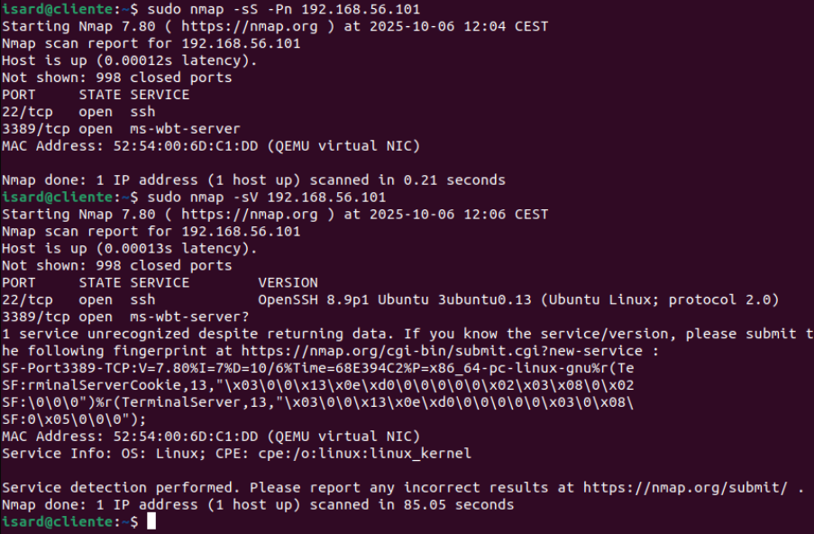
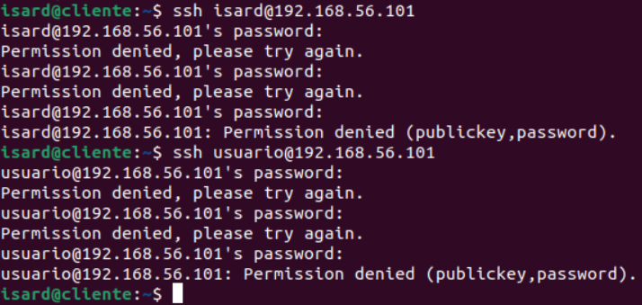
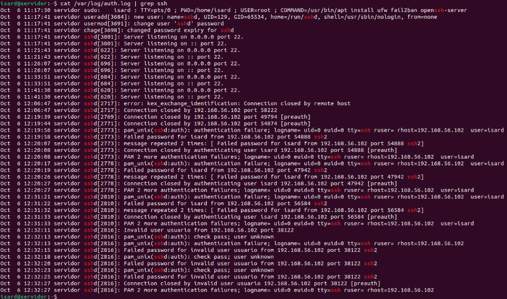
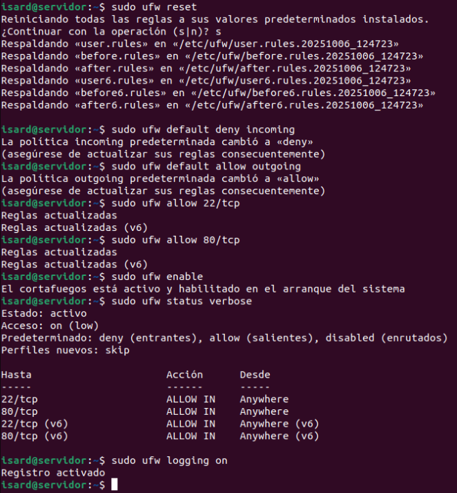
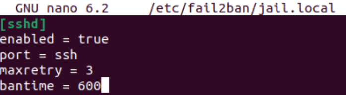
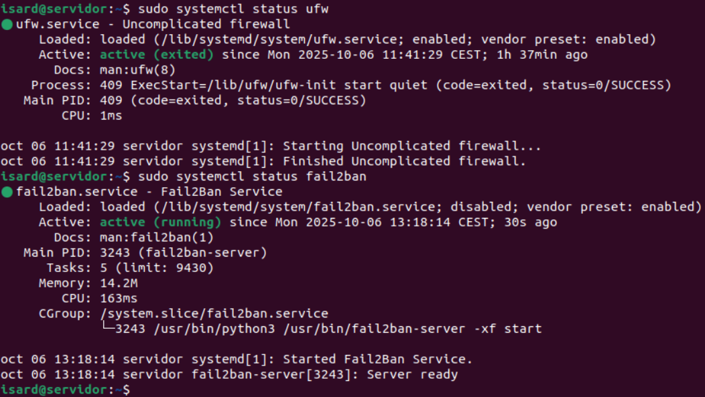
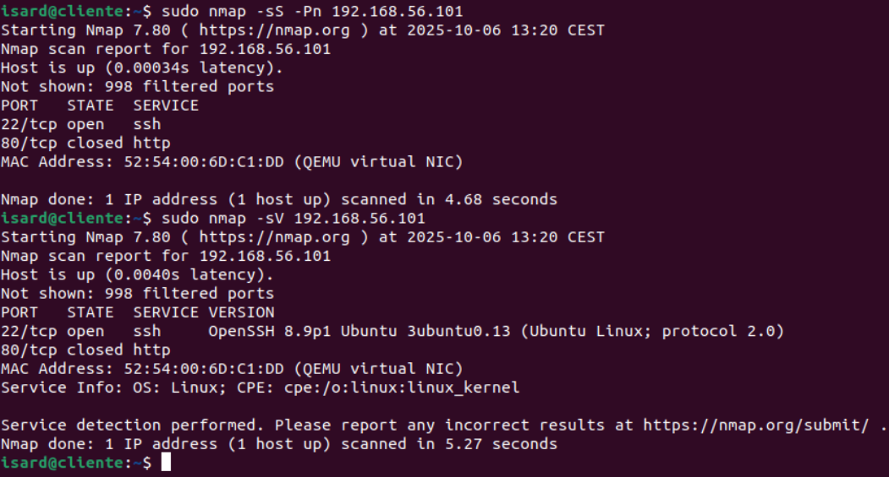
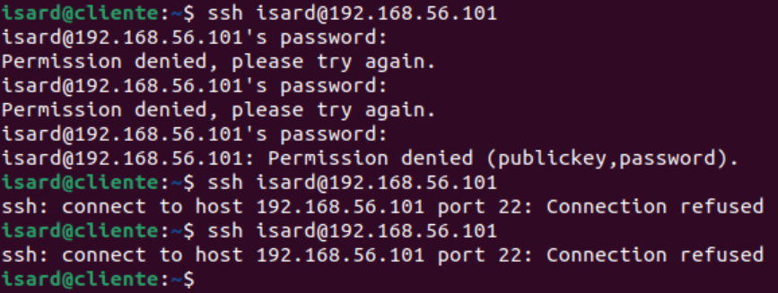
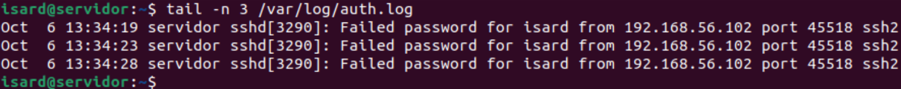
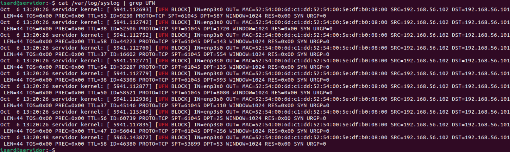

# Reforzamiento de Seguridad SSH + Fail2Ban + UFW

## 1. Antes de proteger el servidor

### 1.1 Escaneos Nmap

**Escaneo con nmap antes de configurar el UFW en el servidor**:

El primer comando con nmap nos devuelve un listado con los nombres de los servicios del servidor con su estado, junto al puerto que están utilizando y el protocolo que utilizan. También se puede ver la dirección MAC y en este caso también indica que la tarjeta de red es virtual, lo que indica que es una máquina virtual, en este caso de Isard.

```bash
sudo nmap -sS -Pn 192.168.56.101
```

El segundo comando con nmap hace lo mismo pero intenta averiguar también qué versión específica de cada servicio está utilizando si es posible, ya que si está desactualizado se pueden explotar vulnerabilidades conocidas de los servicios activos que estén abiertos.

```bash
sudo nmap -sV 192.168.56.101 
```



### 1.2 Simulación de ataques con SSH

**Simulación de ataque de conexión SSH antes de configurar nada en el servidor**:

Simulamos un ataque con SSH de intentar conectarnos y vemos que sin estar protegido el servidor, podemos hacer intentos de fuerza bruta sin consecuencias como un baneo temporal de acceso o de IP si es reiterado, etc. para intentar averiguar unas credenciales válidas del servidor e intentar acceder a él.

```bash
ssh isard@192.168.56.101 
```

```bash
ssh usuario@192.168.56.101 
```



### 1.3 Análisis de logs

**Logs de `/var/log/auth.log` de intentos fallidos con el servidor sin proteger todavía con UFW y Fail2ban**:

Por defecto los intentos de conexiones SSH solo se recogen en /var/log/auth.log si no se configuran que también se guarden en /var/log/syslog.

Como vemos en el registro, el equipo atacante se ha intentado conectar por ssh utilizando el usuario isard y después con el usuario usuario.

```bash
cat /var/log/auth.log | grep ssh
```



## 2. Configuración de protección del servidor con UFW y Fail2ban

### 2.1 Configuración UFW (Uncomplicated Firewall)

Configuramos el UFW (Uncomplicated Firewall) para reestablecer la configuración por defecto y especificamos que todo el tráfico entrante hacia el servidor se deniege permitiendo solamente las conexiones que utilicen el puerto 22 y 80 y permitimos todo el tráfico del servidor hacia afuera y activamos el registro de logs del UFW.

```bash
sudo ufw reset
sudo ufw default deny incoming
sudo ufw default allow outgoing
sudo ufw allow 22/tcp
sudo ufw allow 80/tcp
sudo ufw enable
sudo ufw logging on
```



### 2.2 Configuración Fail2ban

**Creamos el archivo /etc/fail2ban/jail.local con las siguientes configuraciones**:

```ini title="/etc/fail2ban/jail.local"
[sshd]
enabled = true
port = ssh
maxretry = 3
bantime = 600
```



### 2.3 Comprobación de servicios de UFW y Fail2ban activos

```bash
sudo systemctl status ufw
sudo systemctl status fail2ban
```



## 3. Servidor protegido con UFW y Fail2ban

### 3.1 Escaneos Nmap

**Escaneo con nmap después de configurar el UFW y Fail2ban en el servidor**:

Ahora al ejecutar nmap con el servidor protegido cambia que el puerto 3389 del protocolo RDP ya no aparece, porque no lo hemos indicado en las reglas del UFW que permita esas conexiones, ya que solo hemos indicado que permita puerto 22 y 80 y aparece el puerto 80 como closed, ya que al habilitar UFW con una regla del puerto 80 y no detectar ningún servicio web instalado en el servidor como apache, httpd, nginx, etc, deja el puerto cerrado por seguridad.

```bash
sudo nmap -sS -Pn 192.168.56.101
sudo nmap -sV 192.168.56.101
```



### 3.2 Simulación de ataques con SSH

**Simulación de ataque de conexión SSH tras configurar el UFW y Fail2ban en el servidor**:

Ahora al introducir la contraseña mal tres veces en un intento de conexión SSH, baneará al equipo durante 10 minutos como hemos configurado en Fail2ban, y rechaza las conexiones al volver a intentar conectarse por SSH.

```bash
ssh isard@192.168.56.101
```



### 3.3 Análisis de logs

**Logs de `/var/log/auth.log` y `/var/log/syslog` de intentos fallidos con el servidor protegido y configurado con UFW y Fail2ban**:

El `auth.log` nos indica que se ha intentado conectar un equipo con la dirección IP `192.168.56.102` y ha introducido mal tres veces la contraseña.

```bash
tail -n 3 /var/log/auth.log
```



En el archivo `syslog`, como registra a nivel de sistema, nos indica que el UFW ha recibido conexiones entrantes desde la dirección IP `192.168.56.102` (equipo atacante) con destino al servidor que tiene la dirección IP `192.168.56.101`.

```bash
cat /var/log/syslog | grep UFW
```

